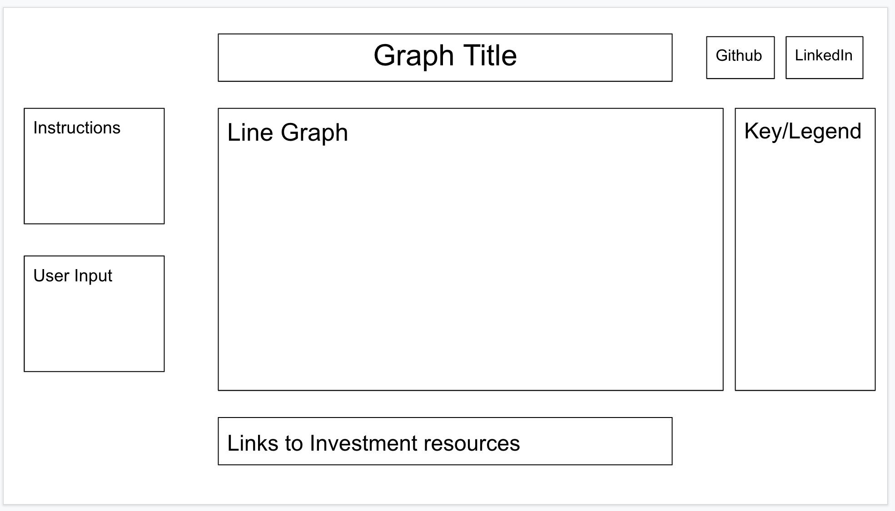

Background

Have you ever wondered what if you saved or invested the $100 rather than spending it on something you don't need? This project is a data visualization of how that amount will grow if you decide to invest it rather than spend it now.

In the data visualization, the user submits an amount they want to watch grow. Then, there are different line graphs displaying different kinds of investments. Using the calculated time value of money as the base, users can compare different investment types and their growth in the long run. The types of investments being compared are: savings account, US Treasury bonds, CDs(Certificate of Desposit), basket of ETFs, and basket of stocks.  

Functionality & MVPs
In To Spend or Not to Spend, users will be able to:
 - enter an amount to watch
 - clear previous amount and select new amount 
 - select points in the line graph and it will show time and new amount
 - zoom into the graph 
 
 In addition, this project will include:
 - links of resources to find more information about a specific investment type
 - instructions and description of the data
 
 Overview
 

 Technologies, Libraries, APIs
 - D3 API to display the data visualization
 - Webpack and Babel to package JS code
 - YH Finance API (https://rapidapi.com/apidojo/api/yh-finance) to retreive historical data in order to calculate projections

Implementation Timeline
- Friday: set up skeleton and server, research D3 library and read documentation on how to use its features to display data
- Monday: use the YH Finance API to pull histroical data, create methods to calculate projections for time value of money, savings, treasury bonds, CDs, and stock investments based on available data
- Tuesday: use D3 library to display a graph consisting of different lines related to each different type of investment. Ensure the graph has title, row label, column label, graph key(legend). Add resources(links) under the graph for users to find more information about each investment type.
- Wednesday: focus on css and user interface experience, make sure the page is responsive 

