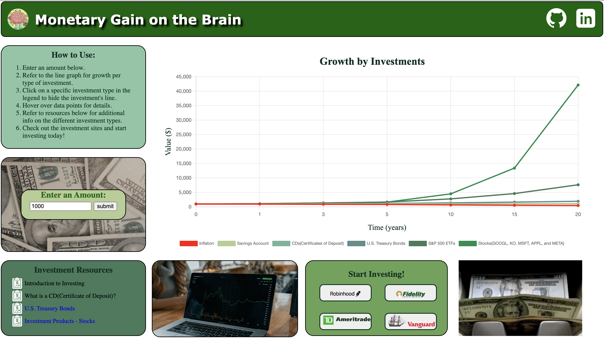

# Background

Have you ever wondered what if you saved or invested the $100 rather than spending it on something you don't need? [Monetary Gain on the Brain](https://maywu4.github.io/javascript_project/ "Monetary Gain on the Brain") is a data visualization of how that amount will grow if you decide to invest it rather than spend it now.

In the data visualization, the user enters an amount they want to watch grow. Then, the graph will display lines representing each kind of investment. Using the calculated future value of money due to inflation as the base, users can compare different investment types and their growth in the long run. The types of investments being compared are: savings account, U.S. Treasury bonds, CDs(Certificate of Desposit), S&P 500 ETFs, and basket of stocks(Alphbet Inc., The Coca-Cola Company, Microsoft Corp., Apple Inc., and Meta Platforms Inc.).  


# Functionality & MVPs
## In To Spend or Not to Spend, users can:
 * enter an amount to watch grow
 * select points in the line graph and it will show time passed and new amount
 * unselect a specific investment type in the graph legend to hide the line
 
## In addition, this project will include:
 * instructions on how to use the project
 * links of resources to find more information about a specific investment type
 * links to financial investment companies to learn more
 
 
 Overview
 


 # Technologies, Libraries, APIs
 - Chart.js to display the data visualization
 - Webpack and Babel to package JS code


# Code Highlights

```javascript 
//javascript_project/src/scripts/calculations.js

export const calcValueCd = function (input, time) {
    //source for avg one-year CD APY: https://www.bankrate.com/banking/cds/historical-cd-interest-rates/
    let output = (input)*(1+(.0052/1))**(1*time);
    return Math.round(output*100)/100;
}


export const calcValueTreasuryBond = function (input, time) {
    //source for 20yr U.S. Treasury Bonds interest rate: https://www.treasurydirect.gov/instit/annceresult/annceresult.htm 
    let output = (input)*(1+(.03375/1))**(1*time);
    return Math.round(output*100)/100;
}

export const calcValueSP500 = function (input, time) {
    //source for S&P 500 annual growth rate: https://www.fool.com/investing/how-to-invest/index-funds/average-return/
    let output = (input)*(1+(.1070/1))**(1*time);
    return Math.round(output*100)/100;

```

The code above are the functions to manually calculate the future value of a current investment based on investment types( Certificate of Deposits, Treasury Bonds, and S&P 500 ETFs). These calculations are based on future projected growth of investments from external resources. 

