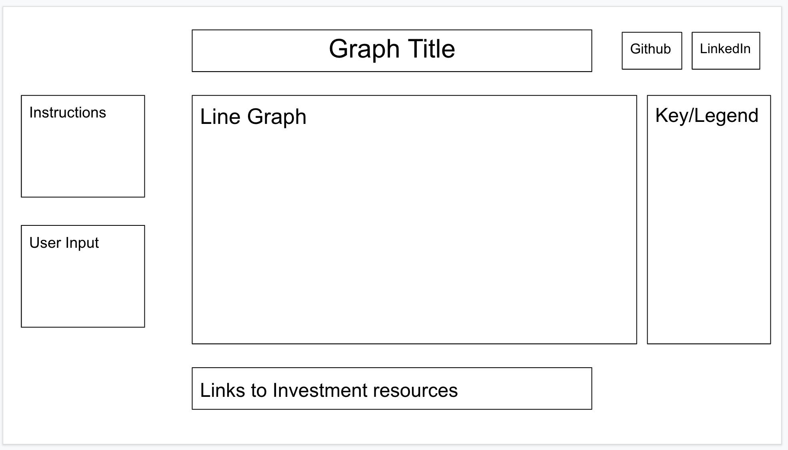

Background

Have you ever wondered what if you saved or invested the $100 rather than spending it on something you don't need? This project is a data visualization of how that amount will grow if you decide to invest it rather than spend it now.

In the data visualization, the user enters an amount they want to watch grow. Then, the graph will display lines representing each kind of investment. Using the calculated future value of money due to inflation as the base, users can compare different investment types and their growth in the long run. The types of investments being compared are: savings account, U.S. Treasury bonds, CDs(Certificate of Desposit), S&P 500 ETFs, and basket of stocks(Alphbet Inc., The Coca-Cola Company, Microsoft Corp., Apple Inc., and Meta Platforms Inc.).  

Functionality & MVPs
In To Spend or Not to Spend, users will be able to:
 - enter an amount to watch
 - select points in the line graph and it will show time and new amount
 - unselect a specific investment type in the graph legend to hide the line
 
 In addition, this project will include:
 - instructions on how to use the project
 - links of resources to find more information about a specific investment type
 - links to financial investment companies to learn more
 
 
 Overview
 

 Technologies, Libraries, APIs
 - Chart.js to display the data visualization
 - Webpack and Babel to package JS code

Implementation Timeline
- Friday: set up skeleton and server, create functions to calculate projections for time value of money, savings, treasury bonds, CDs, and stock investments based on available data
- Monday: research Chart.js library and read documentation on how to use its features to display data. Implement Chart.js to display a graph consisting of different lines related to each different type of investment. Ensuring it has title, row label, column label, graph key(legend) and can 'click' on data points. 
- Tuesday: Update index.html; add instructions, place for user input, Github and Linkedin buttons, and resources(links) under the graph for users to find more information about each investment type.
- Wednesday: focus on css and user interface experience 

